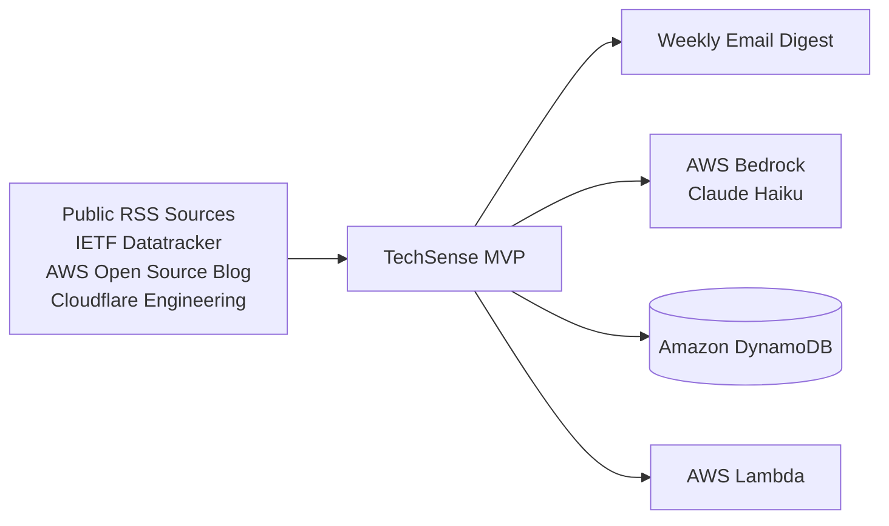
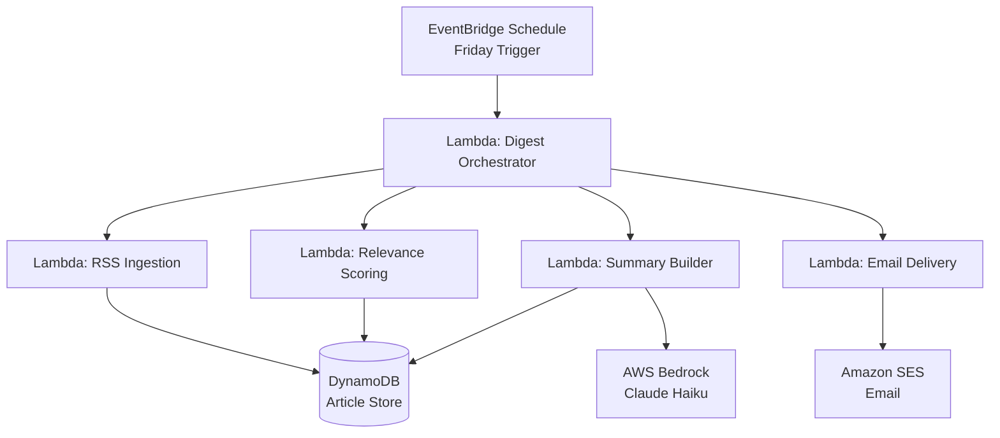

# TechSense MVP System Design

## 1. Scope and Design Constraints

This document defines the MVP (Phase 1) architecture for TechSense only. The design is constrained by four non-negotiables:

- Annual budget cap: $500 USD.
- Serverless-first implementation.
- Weekly Friday delivery of a curated top-five digest.
- RSS ingestion from three sources with LLM-based filtering and summarization.

The MVP must stay simple enough to run continuously on very low spend, ideally within AWS free-tier-style usage patterns and minimal operational overhead.

## 2. C4 Context

### 2.1 System Context

TechSense sits between public technical information sources and a single human consumer.



### 2.2 Context-Level Responsibilities

- Public RSS sources provide technical news, standards updates, and engineering articles.
- TechSense ingests new items, filters for relevance, ranks the best candidates, and produces one weekly digest.
- Amazon Bedrock provides lightweight LLM reasoning for relevance scoring and summary generation.
- DynamoDB stores article metadata, source state, deduplication markers, and weekly output records.
- Email is the only delivery channel in the MVP.

## 3. C4 Container Design

### 3.1 Container View



### 3.2 Container Responsibilities

- EventBridge triggers the workflow once per week on Friday.
- The digest orchestrator coordinates the pipeline and keeps the runtime bounded.
- Ingestion Lambda fetches the selected RSS feeds and normalizes entries.
- Scoring Lambda removes duplicates and assigns relevance using lightweight heuristics plus LLM support when needed.
- Summary Builder Lambda asks Bedrock for concise summaries of the top-ranked items.
- Email Delivery Lambda sends one final digest to the user via SES.
- DynamoDB persists feed state, seen items, candidate articles, and weekly digest history.

## 4. Component Analysis

### 4.1 EventBridge Scheduler

- **Technology:** Amazon EventBridge Scheduler
- **Role:** Weekly trigger
- **Cost Impact:** Low
- **Justification:** A managed weekly schedule is the cheapest reliable way to start the workflow every Friday with no server maintenance.
- **Alternatives Considered:** A long-running container or cron on EC2 would be unnecessary operational overhead and outside the serverless-first goal.

### 4.2 Lambda: Digest Orchestrator

- **Technology:** AWS Lambda
- **Role:** Workflow coordination
- **Cost Impact:** Low
- **Justification:** A short-lived orchestrator can coordinate the MVP pipeline without paying for idle compute. The workflow is naturally bounded and periodic.
- **Alternatives Considered:** ECS Fargate would add always-on operational complexity and higher baseline spend for no MVP advantage.

### 4.3 Lambda: RSS Ingestion

- **Technology:** AWS Lambda
- **Role:** Ingestion
- **Cost Impact:** Low
- **Justification:** RSS fetching is lightweight, bursty, and well suited to Lambda. It scales only when the weekly job runs and stays well aligned with free-tier-style usage.
- **Alternatives Considered:** Containerized ingestion workers are better reserved for a later phase if feed count or parsing complexity grows.

### 4.4 DynamoDB Article Store

- **Technology:** Amazon DynamoDB
- **Role:** Persistent state and article store
- **Cost Impact:** Low
- **Justification:** DynamoDB is a strong fit for small metadata records, deduplication keys, source checkpoints, and weekly digest state. It avoids database administration and supports a very low-cost operating model.
- **Alternatives Considered:** RDS would introduce unnecessary cost and maintenance. OpenSearch would be excessive for an MVP article tracker.

### 4.5 Lambda: Relevance Scoring

- **Technology:** AWS Lambda
- **Role:** Filtering and ranking
- **Cost Impact:** Low to Medium
- **Justification:** Ranking the weekly feed can be done with a small amount of logic and selective LLM calls. Lambda keeps the execution cost proportional to the number of new items.
- **Alternatives Considered:** A container-based scoring service would be overkill unless the scoring logic becomes much more complex or continuous.

### 4.6 Amazon Bedrock (Claude Haiku)

- **Technology:** Amazon Bedrock
- **Role:** Reasoning and summarization
- **Cost Impact:** Medium
- **Justification:** Claude Haiku is a sensible cost-conscious model for concise technical classification and summary generation. Bedrock gives managed access to LLM reasoning without hosting model infrastructure.
- **Alternatives Considered:** Larger models would increase token spend without clear MVP value. Self-hosted models would violate the low-ops, low-cost objective.

### 4.7 Lambda: Summary Builder

- **Technology:** AWS Lambda
- **Role:** Digest assembly
- **Cost Impact:** Low
- **Justification:** The digest is assembled once per week, so Lambda is ideal for formatting the top five items into a final email-ready payload.
- **Alternatives Considered:** A separate always-on service is unnecessary for a weekly batch output.

### 4.8 Amazon SES

- **Technology:** Amazon Simple Email Service
- **Role:** Delivery
- **Cost Impact:** Low
- **Justification:** SES is the cheapest native AWS option for sending weekly email notifications and fits the single-channel MVP requirement.
- **Alternatives Considered:** Third-party transactional email services can work, but they add integration overhead and reduce the value of staying inside the AWS budget envelope.

## 5. MVP Data Flow

1. EventBridge triggers the workflow every Friday.
2. The orchestrator invokes ingestion for the three selected feeds.
3. RSS items are normalized and stored in DynamoDB.
4. The scoring step filters duplicates and ranks articles by relevance to architectural and cloud-native topics.
5. The top five candidates are sent to Bedrock for concise summarization.
6. The final digest is formatted and emailed through SES.
7. Weekly results and article hashes are retained in DynamoDB for auditing and deduplication.

## 6. Cost Control Strategy

The MVP stays within the annual $500 budget by constraining both execution frequency and model usage.

- Run only once per week.
- Process only three feeds in Phase 1.
- Use DynamoDB for metadata, not large content storage.
- Keep summaries short and use Claude Haiku rather than larger models.
- Minimize Bedrock calls by pre-filtering with deterministic rules before LLM scoring.
- Send one email per week instead of continuous notifications.

### Budget Posture

- Compute: Very low, because Lambda runs only on schedule.
- Storage: Very low, because DynamoDB stores compact article state.
- AI inference: Controlled, because only top candidates are summarized.
- Delivery: Very low, because SES sends one digest per week.

## 7. Why Lambda Over ECS Fargate for the MVP

Lambda is the right foundation for Phase 1 because the workload is batch-oriented, short-lived, and low-volume. The MVP does not need container scheduling, sidecars, service mesh patterns, or long-running workers.

### Lambda Advantages for MVP

- Lower operational overhead.
- Better fit for weekly scheduled execution.
- Better alignment with free-tier-style spend.
- Faster delivery of the first usable version.

### Why Not Fargate Yet

- Fargate introduces a baseline cost even when the system is idle.
- It adds infrastructure complexity before the product proves its value.
- The MVP does not yet require persistent workers or advanced orchestration.

## 8. AI-Ready Integration Schema

The following schema is the standard format for future TechSense feature refinement. It is compatible with the requirements and can be reused for backlog grooming or AI-assisted planning.

```json
{
  "feature_name": "string",
  "priority": "low|medium|high",
  "cost_impact_estimated": "float",
  "ai_agent_task": "string",
  "dependencies": ["list_of_services"]
}
```

### MVP Feature Entries

```json
[
  {
    "feature_name": "weekly_rss_ingestion",
    "priority": "high",
    "cost_impact_estimated": 0.5,
    "ai_agent_task": "Fetch and normalize the three MVP RSS sources every Friday.",
    "dependencies": ["AWS Lambda", "EventBridge", "DynamoDB"]
  },
  {
    "feature_name": "relevance_scoring",
    "priority": "high",
    "cost_impact_estimated": 1.5,
    "ai_agent_task": "Rank incoming items and identify the top five most relevant articles.",
    "dependencies": ["AWS Lambda", "Amazon Bedrock", "DynamoDB"]
  },
  {
    "feature_name": "weekly_email_digest",
    "priority": "high",
    "cost_impact_estimated": 0.25,
    "ai_agent_task": "Generate and deliver a Friday email with the top five summarized articles.",
    "dependencies": ["AWS Lambda", "Amazon SES", "Amazon Bedrock"]
  },
  {
    "feature_name": "deduplication_and_state_tracking",
    "priority": "medium",
    "cost_impact_estimated": 0.25,
    "ai_agent_task": "Track seen articles and prevent duplicate items from reaching the digest.",
    "dependencies": ["DynamoDB"]
  }
]
```

## 9. MVP Rejected Alternatives

- ECS Fargate: rejected for MVP because the workload is too small to justify baseline container spend.
- SQS-driven distributed workers: rejected for MVP because the weekly batch does not yet need decoupled worker scaling.
- Multi-agent orchestration: rejected for MVP because the value is in proving the weekly digest first.
- Larger LLMs: rejected for MVP because cost control matters more than model sophistication at this stage.
- Multi-channel delivery: rejected for MVP because email alone is enough to validate the product.

## 10. MVP Success Criteria

- One scheduled run every Friday.
- Three feeds ingested successfully.
- Top five articles selected with stable relevance.
- Weekly email delivered successfully.
- Spend remains comfortably inside the $500 annual budget.
- The system remains simple enough to evolve into the later Fargate-based roadmap without redesigning the data model.
