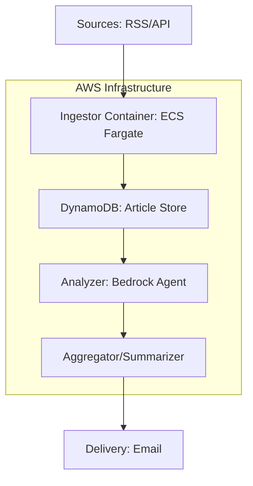

# Project: "TechSense" - AI-Driven Architectural Intelligence Pipeline

## 1. Intent
The objective is to build an automated, scalable pipeline that ingests, filters, and summarizes high-level technical news (RFCs, architectural trends, protocol updates) from various industry sources. The project aims to minimize information overload by delivering a curated, high-relevance "Top 5" summary weekly, leveraging AWS serverless architecture and LLM reasoning.

## 2. Motivation
*   **Information Density:** Technical landscape (e.g., RFC 10008, HTTP protocol evolution) evolves faster than manual tracking allows.
*   **Architectural Efficiency:** As a Solutions Architect and AWS Community Builder, maintaining deep domain knowledge requires filtered, high-signal inputs.
*   **Capability Alignment:** Utilizing AWS container expertise to build a CI/CD-driven system that manages its own "toil."

## 3. Solution Proposal & Iterative Roadmap

### MVP (Phase 1: The Foundation)
*   **Scope:** RSS ingestion from 3 key sources, filtering by LLM, delivery to a weekly email digest.
*   **Architecture:** AWS Lambda (Python), DynamoDB, Amazon Bedrock (Claude Haiku).
*   **Cost Strategy:** Serverless-first. 99% within AWS Free Tier.

#### Phase 1 Source Shortlist
The initial MVP should prioritize a small, high-signal set of feeds drawn from the broader TechSense source universe below. The goal is to keep the first version focused while still covering protocol evolution, cloud-native engineering, and architecture commentary.

*   **IETF Datatracker (Recent RFCs):** Primary source for standards and protocol evolution, including RFC-level changes and Internet draft activity.
*   **AWS Open Source Blog:** Tracks AWS engineering work related to containers, orchestration, and cloud-native tooling.
*   **The Cloudflare Blog (Engineering):** High-signal source for real-world protocol and network engineering changes.
*   **Kubernetes Blog:** Official ecosystem updates for container orchestration and platform evolution.
*   **InfoQ (Architecture & Design):** Broad architecture and systems-thinking coverage for enterprise and platform design.
*   **CNCF Blog:** Updates on cloud-native building blocks such as service meshes, observability, and runtimes.
*   **The Pragmatic Engineer:** High-level engineering strategy, system design, and scaling lessons from large technology companies.
*   **API Developer Weekly:** Curated coverage focused on API design, tooling, and communication standards.
*   **Hacker News (Algolia API - High Signal):** Optional high-signal filter for topics that score well by popularity and relevance.
*   **W3C News:** Complements IETF with browser, web platform, and application-layer standards updates.

**Recommended MVP subset:** Start with IETF Datatracker, AWS Open Source Blog, and Cloudflare Engineering, then expand to the other feeds once ranking quality and delivery cadence are stable.

### Iteration 2 (Phase 2: Scalability & Observability)
*   **Scope:** Migrating the pipeline to Amazon ECS on AWS Fargate.
*   **Architecture:** Containerized Go/Python workers, SQS for decoupling tasks, OpenTelemetry for tracing.
*   **Benefit:** Portability and alignment with container best practices.

### Iteration 3 (Phase 3: Robust Intelligence)
*   **Scope:** Multi-agent system. One agent for ingestion/scoring, one for deep technical analysis, one for delivery management.
*   **Architecture:** ECS Fargate + Step Functions. 
*   **Cost Strategy:** Managed by credits, monitoring via CloudWatch Cost Explorer.

## 4. Architectural Diagram



## 5. Cost Breakdown & Metrics (Annual Budget: $500.00)

| Service | Category | Est. Monthly Cost | Metric for Review |
| :--- | :--- | :--- | :--- |
| **ECS Fargate** | Compute | $2.00 - $5.00 | CPU/Memory utilization |
| **DynamoDB** | Storage | $0.00 | Read/Write units |
| **Bedrock (Claude)** | AI Inference | $1.00 - $2.00 | Input/Output tokens |
| **CloudWatch** | Observability | $0.50 | Log ingest volume |
| **Total** | | **~$4.00 - $8.00** | **Total burn rate** |

## 6. AI-Ready Integration Schema
To facilitate code agent refinement, follow this schema for new features:

```json
{
  "feature_name": "string",
  "priority": "low|medium|high",
  "cost_impact_estimated": "float",
  "ai_agent_task": "string",
  "dependencies": ["list_of_services"]
}
```

## 7. System Design Reference
The canonical MVP system design for TechSense is documented in [system_design.md](/Users/macbook-jesus/Desktop/techsense-071826/docs/system_design.md). This file captures the Phase 1 architecture, C4 Context and Container views, cost controls, rejected alternatives, and the AI-ready feature schema used for implementation planning.